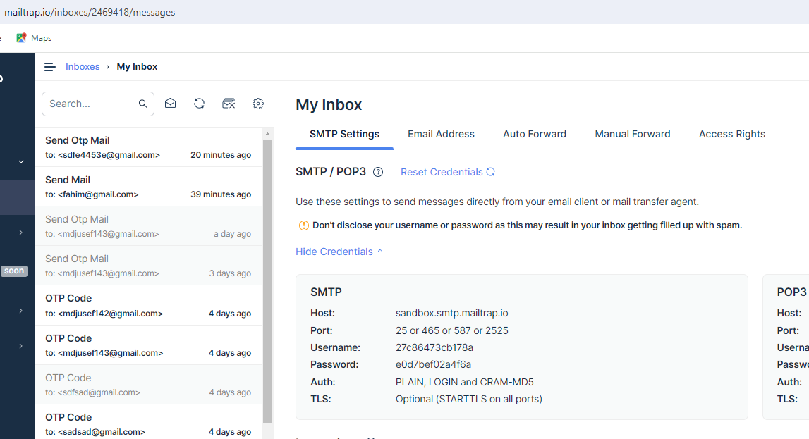
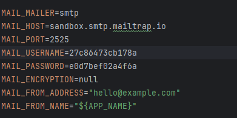
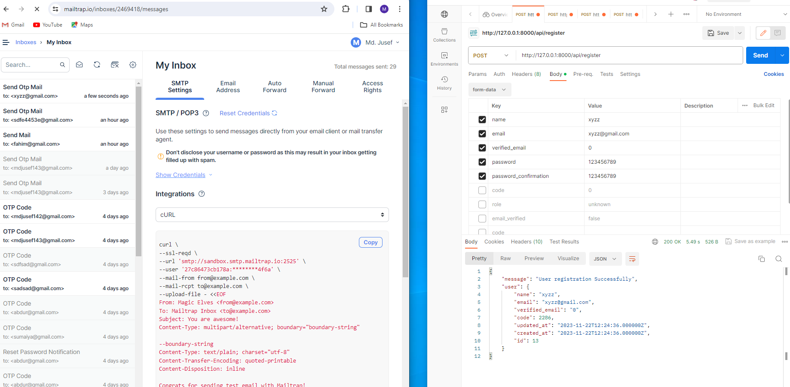

install laravel:
composer create-project laravel/laravel authentication

jwt authentication:
step1:
composer require tymon/jwt-auth

step2:
Add the service provider to the providers array in the config/app.php config file as follows: 
'providers' => [ Tymon\JWTAuth\Providers\LaravelServiceProvider::class, ]

step3:
Run the following command to publish the package config file:
 php artisan vendor:publish --provider="Tymon\JWTAuth\Providers\LaravelServiceProvider"
after running this command config/jwt.php file will be added.

step4:
Generate jwt Secret key using following command:
php artisan jwt:secret

step5:
Update your User model
Firstly you need to implement the Tymon\JWTAuth\Contracts\JWTSubject contract on your User model, which requires that you implement the 2 methods getJWTIdentifier() and getJWTCustomClaims().

The example below should give you an idea of how this could look. Obviously you should make any changes necessary to suit your own needs.

<?php

namespace App;

use Tymon\JWTAuth\Contracts\JWTSubject;
use Illuminate\Notifications\Notifiable;
use Illuminate\Foundation\Auth\User as Authenticatable;

class User extends Authenticatable implements JWTSubject
{
    use Notifiable;

    public function getJWTIdentifier()
    {
        return $this->getKey();
    }

    public function getJWTCustomClaims()
    {
        return [];
    }
}

Configure Auth guard
Note: This will only work if you are using Laravel 5.2 and above.

Inside the config/auth.php file you will need to make a few changes to configure Laravel to use the jwt guard to power your application authentication.

Make the following changes to the file:

'defaults' => [
    'guard' => 'api',
    'passwords' => 'users',
],

...

'guards' => [
    'api' => [
        'driver' => 'jwt',
        'provider' => 'users',
    ],
]

mailtrap setup for send mail:
step1:
Firstly you have to create account in https://mailtrap.io/ this link,

step2:
update your .env file like this:

step 3:
run this command line for SendOtpMail.php file
php artisan make:mail SendOtpMail

step 4:
modify this file for otp send:
class SendOtpMail extends Mailable
{
    use Queueable, SerializesModels;

    public $code;
    public function __construct($code)
    {
        //
        $this->code = $code;
    }

    public function envelope(): Envelope
    {
        return new Envelope(
            subject: 'Send Otp Mail',
        );
    }

    public function content(): Content
    {
        return new Content(
            view: 'email.otp',
        );
    }
    
    public function attachments(): array
    {
        return [];
    }
}

step5:
from controller, you can send mail using below command:
Mail::to($email)->send(new SendOtpMail($code));
here:
$email = "where you want to send otp"
$code = "random generate otp code"

step6:
you should use below package for mail
use Illuminate\Support\Facades\Mail;

Test Api Route Using Postman:
http://127.0.0.1:8000/api/register

http://127.0.0.1:8000/api/login
http://127.0.0.1:8000/api/verified
http://127.0.0.1:8000/api/login
http://127.0.0.1:8000/api/profile
http://127.0.0.1:8000/api/update-password
http://127.0.0.1:8000/api/logout
http://127.0.0.1:8000/api/

